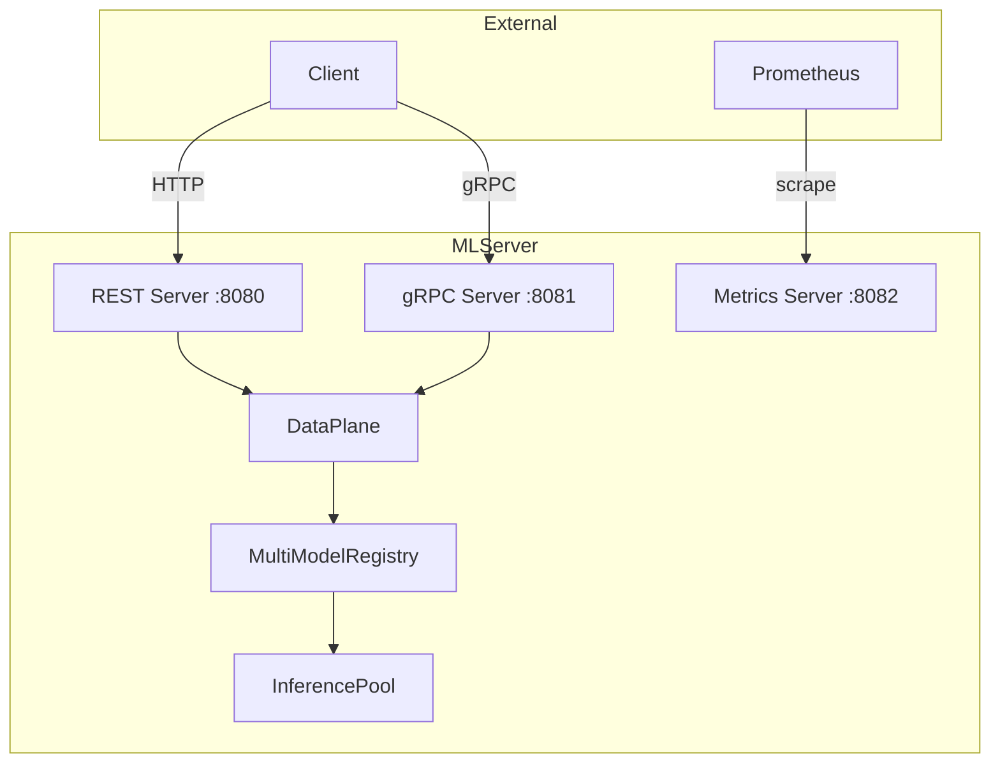

<p align="center">
  
</p>

<p align="center">
  <strong>An open source inference server for your machine learning models.</strong>
</p>

<p align="center">
  <a href="https://pypi.org/project/mlserver"></a>
  <a href="https://pypi.org/project/mlserver"></a>
  <a href="https://github.com/opendatahub-io/MLServer/blob/main/LICENSE"></a>
  <a href="https://github.com/opendatahub-io/MLServer/actions/workflows/tests.yml"></a>
  <a href="https://github.com/opendatahub-io/MLServer/stargazers"></a>
</p>

---

## Table of Contents

- [Why MLServer?](#why-mlserver)
- [Quick Start](#quick-start)
- [Features](#features)
- [Architecture](#architecture)
- [Inference Runtimes](#inference-runtimes)
- [How MLServer Compares](#how-mlserver-compares)
- [Examples](#examples)
- [Engineering Documentation](#engineering-documentation)
- [Contributing & Community](#contributing--community)
- [Developer Guide](#developer-guide)
- [License](#license)

---

## Why MLServer?

You've trained a model. Now what?

Getting a model from a Jupyter notebook into a production API that's reliable,
observable, and secure is harder than it should be. Most teams end up writing
custom Flask or FastAPI wrappers, re-inventing health checks, batching, metrics,
and multi-model routing from scratch every time.

**MLServer gives you all of that out of the box**, with a standardised wire
format that works across frameworks:

- **One server, many models** — serve scikit-learn, XGBoost, HuggingFace,
  ONNX, and custom models side by side in a single process. No per-model
  containers needed.
- **Production-grade by default** — health probes, Prometheus metrics,
  adaptive batching, parallel workers, and response caching are built in,
  not bolted on.
- **Standards-based** — implements the
  [V2 Inference Protocol](https://kserve.github.io/website/latest/modelserving/data_plane/v2_protocol/)
  over both REST and gRPC, so your clients work with MLServer, NVIDIA Triton,
  TorchServe, or any other V2-compliant server without code changes.
- **Kubernetes native** — the core Python runtime behind
  [KServe](https://kserve.github.io/website/) InferenceServices, with
  first-class support for readiness probes, model lifecycle, and rolling
  deployments.

---

## Quick Start

### 1. Install

```bash
pip install mlserver mlserver-sklearn
```

### 2. Train and save a model

```python
# train.py
from sklearn.datasets import load_iris
from sklearn.linear_model import LogisticRegression
import joblib

X, y = load_iris(return_X_y=True)
model = LogisticRegression(max_iter=200).fit(X, y)
joblib.dump(model, "model.joblib")
```

### 3. Create a model settings file

```json
{
  "name": "iris",
  "implementation": "mlserver_sklearn.SKLearnModel",
  "parameters": {
    "uri": "./model.joblib",
    "version": "v1"
  }
}
```

Save this as `model-settings.json` in the same directory.

### 4. Start serving

```bash
mlserver start .
```

### 5. Make a prediction

```bash
curl -s localhost:8080/v2/models/iris/infer \
  -H 'Content-Type: application/json' \
  -d '{
    "inputs": [{
      "name": "predict",
      "shape": [1, 4],
      "datatype": "FP32",
      "data": [[5.1, 3.5, 1.4, 0.2]]
    }]
  }' | python -m json.tool
```

```json
{
  "model_name": "iris",
  "model_version": "v1",
  "id": "...",
  "outputs": [{
    "name": "predict",
    "shape": [1, 1],
    "datatype": "INT64",
    "data": [0]
  }]
}
```

That's it. You now have a model behind a V2-compliant REST + gRPC API with
health checks, Prometheus metrics, and Swagger UI at
[localhost:8080/v2/docs](http://localhost:8080/v2/docs).

---

## Features

| Feature | What it does | Why it matters |
|---------|-------------|----------------|
| **Multi-model serving** | Run multiple models in a single server with independent versioning and lifecycle | Reduce infrastructure overhead; no per-model container sprawl |
| **Parallel inference** | Bypass the Python GIL via multiprocessing worker pools | True CPU-parallel prediction for throughput-sensitive workloads |
| **Adaptive batching** | Transparently group incoming requests into batches by size or time threshold | Higher GPU/CPU utilization without client-side batching logic |
| **Response caching** | LRU cache keyed on request payload | Avoid redundant computation for repeated inputs |
| **Streaming inference** | Server-Sent Events (REST) and bidirectional streaming (gRPC) | Token-by-token generation for LLMs and iterative models |
| **Runtime security** | DEVELOPMENT / PRODUCTION dual-mode allowlist | Prevent arbitrary code execution in production images |
| **V2 Inference Protocol** | REST + gRPC wire format standard | Client portability across serving frameworks |
| **Prometheus metrics** | Request count, latency, and failure counters per model | Production observability out of the box |
| **OpenTelemetry tracing** | Distributed trace propagation via OTLP | End-to-end request tracing across microservices |
| **Codec system** | Two-level type conversion (InputCodec + RequestCodec) | Automatic NumPy, Pandas, string, datetime conversion |
| **Custom runtimes** | Subclass `MLModel` with `load()` and `predict()` | Serve any model framework in under 20 lines of Python |

---

## Architecture



Both REST and gRPC transports converge on a single **DataPlane** handler that
manages inference middleware, Prometheus instrumentation, and response caching.
The **MultiModelRegistry** maps model names to versioned instances, and the
**InferencePool** dispatches work to parallel workers when configured.

For detailed architecture documentation including component diagrams,
sequence flows, and design decisions, see the
[Architecture Guide](./docs/engineering/architecture.md).

---

## Inference Runtimes

Inference runtimes are the backend glue between MLServer and your ML framework.
You can [write custom runtimes](./docs/runtimes/custom.md) by subclassing
`MLModel`.

### Shipped Runtimes (included in production images)

These runtimes are installed in the ODH midstream container images and
covered by the default trusted runtimes allowlist:

| Framework | Package | Image | Documentation |
|-----------|---------|-------|---------------|
| Scikit-Learn | `mlserver-sklearn` | CPU | [Docs](./runtimes/sklearn) |
| XGBoost | `mlserver-xgboost` | CPU | [Docs](./runtimes/xgboost) |
| LightGBM | `mlserver-lightgbm` | CPU | [Docs](./runtimes/lightgbm) |
| ONNX Runtime | `mlserver-onnx` | CPU + CUDA | [Docs](./runtimes/onnx) |

### Community Runtimes (source available, not shipped)

These runtimes have source code and tests in this repository but are **not**
included in the production container images. They can be installed separately
via `pip` or baked into custom images with `mlserver build`:

| Framework | Package | Documentation |
|-----------|---------|---------------|
| CatBoost | `mlserver-catboost` | [Docs](./runtimes/catboost) |
| MLflow | `mlserver-mlflow` | [Docs](./runtimes/mlflow) |
| HuggingFace | `mlserver-huggingface` | [Docs](./runtimes/huggingface) |
| Alibi Detect | `mlserver-alibi-detect` | [Docs](./runtimes/alibi-detect) |
| Alibi Explain | `mlserver-alibi-explain` | [Docs](./runtimes/alibi-explain) |
| Spark MLlib | `mlserver-mllib` | [Docs](./runtimes/mllib) |

### Supported Python Versions

| Python | Status |
|--------|--------|
| 3.10 | Supported |
| 3.11 | Supported |
| 3.12 | Supported |

Python 3.9 and earlier are no longer supported. Python 3.13 is not yet tested.

---

## How MLServer Compares

| Capability | MLServer | NVIDIA Triton | TorchServe | BentoML |
|-----------|----------|---------------|------------|---------|
| V2 Inference Protocol | REST + gRPC | REST + gRPC | REST + gRPC | REST (custom) |
| Multi-model serving | Built-in | Built-in | Limited | Built-in |
| Adaptive batching | Built-in | Built-in | Built-in | Built-in |
| Parallel inference (Python) | Multiprocessing pool | C++ backends | Java workers | Runner workers |
| Custom Python runtimes | Subclass `MLModel` | Python backend | Handler class | Service class |
| KServe integration | Native runtime | Supported | Supported | Supported |
| Response caching | Built-in | External | External | External |
| Streaming inference | SSE + gRPC | gRPC | Not built-in | SSE |
| Runtime security modes | Built-in allowlist | Model control | Not built-in | Not built-in |
| Language | Python | C++ / Python | Java / Python | Python |

MLServer is purpose-built for **Python ML frameworks** with a focus on
standards compliance, security, and Kubernetes-native deployment. If your
workload is Python models served on Kubernetes via KServe, MLServer is the
natural fit.

---

## Examples

To see MLServer in action, check out the [full list of examples](./docs/examples/index.md):

| Example | Framework |
|---------|-----------|
| [Serving a scikit-learn model](./docs/examples/sklearn/README.md) | Scikit-Learn |
| [Serving an XGBoost model](./docs/examples/xgboost/README.md) | XGBoost |
| [Serving a LightGBM model](./docs/examples/lightgbm/README.md) | LightGBM |
| [Serving a CatBoost model](./docs/examples/catboost/README.md) | CatBoost |
| [Serving an ONNX model](./docs/examples/onnx/README.md) | ONNX Runtime |
| [Serving a custom model](./docs/examples/custom/README.md) | Custom runtime |
| [Serving an Alibi Detect model](./docs/examples/alibi-detect/README.md) | Alibi Detect |
| [Serving a HuggingFace model](./docs/examples/huggingface/README.md) | HuggingFace |
| [Multi-model serving](./docs/examples/mms/README.md) | Multiple frameworks |
| [Model repository management](./docs/examples/model-repository/README.md) | Dynamic load/unload |

---

## Engineering Documentation

| Document | Description |
|----------|-------------|
| [Architecture](./docs/engineering/architecture.md) | System design with 8 Mermaid diagrams |
| [API Reference](./docs/engineering/api.md) | REST, gRPC, and Kafka endpoint reference |
| [ADRs](./docs/engineering/adr/) | Architecture Decision Records |
| [Deployment](./docs/engineering/deployment.md) | Container images, Kubernetes, health checks |
| [Security](./docs/engineering/security.md) | Runtime security model reference |
| [Onboarding](./docs/engineering/onboarding.md) | New developer setup guide |
| [FAQ](./docs/engineering/faq.md) | Common questions and troubleshooting |

---

## Contributing & Community

We welcome contributions of all kinds. Whether you're fixing a typo, adding a
runtime, or improving documentation, here's how to get involved:

- **[Contributing Guide](./CONTRIBUTING.md)** — development setup, code style,
  commit conventions, and PR process
- **[Good first issues](https://github.com/opendatahub-io/MLServer/issues?q=is%3Aissue+is%3Aopen+label%3A%22good+first+issue%22)** —
  curated issues for new contributors
- **[Open issues](https://github.com/opendatahub-io/MLServer/issues)** —
  report bugs or request features

### Runtime Security Maintainer Note

If you add a new core runtime shipped by this repository:

1. Add the runtime import path to `ALLOWED_MODEL_IMPLEMENTATIONS` in
   `mlserver/settings.py`.
2. Add or update tests validating allowlist behavior.
3. Keep runtime docs/examples aligned with the implementation import path.

For third-party custom runtimes, use the image-scoped workflow with
`mlserver build` instead of extending the global allowlist. See the
[Security Guide](./docs/engineering/security.md) for details.

---

## Developer Guide

### Versioning

Both the main `mlserver` package and the [inference runtimes](./docs/runtimes/index.md)
follow the same versioning schema. To bump the version across all packages:

```bash
./hack/update-version.sh 0.2.0.dev1
```

### Testing

```bash
# Run all tests
make test

# Run tests for a single file
tox -e py3 -- tests/batch_processing/test_rest.py
```

See the [Onboarding Guide](./docs/engineering/onboarding.md) for full
development environment setup.

---

## License

MLServer is licensed under the
[Apache License, Version 2.0](./LICENSE).

Note that some inference runtimes used alongside MLServer may be licensed under
different terms. For example, Alibi Detect and Alibi Explain are licensed under
the Business Source License 1.1. Refer to each runtime's documentation for
details.
