# MLServer Architecture

> Internal engineering reference for the MLServer inference platform.
> This document describes the system architecture, component interactions,
> data flows, and key design patterns used throughout the codebase.

---

## Table of Contents

- [System Overview](#system-overview)
- [C4 Context Diagram](#c4-context-diagram)
- [Core Domain Model](#core-domain-model)
- [Inference Request Flow](#inference-request-flow)
- [Model Lifecycle](#model-lifecycle)
- [Parallel Inference](#parallel-inference)
- [Adaptive Batching](#adaptive-batching)
- [Codec System](#codec-system)
- [Runtime Security](#runtime-security)
- [Server Component Layout](#server-component-layout)
- [Configuration Architecture](#configuration-architecture)
- [Runtime Plugins](#runtime-plugins)

---

## System Overview

MLServer is a Python-based inference server implementing the
[V2 Inference Protocol](https://kserve.github.io/website/latest/modelserving/data_plane/v2_protocol/)
(also known as the Open Inference Protocol). It serves ML models over REST
(FastAPI/Uvicorn) and gRPC simultaneously, with optional Kafka message-bus
integration and a dedicated Prometheus metrics endpoint.

Key architectural properties:

- **Multi-model serving** — a single server instance hosts multiple models,
  each with independent versioning, lifecycle, and readiness state.
- **Parallel inference** — bypasses the Python GIL via multiprocessing worker
  pools, enabling true CPU-parallel prediction across models.
- **Adaptive batching** — transparently groups incoming requests into batches
  based on configurable size and time thresholds.
- **Pluggable runtimes** — model-serving logic is decoupled into runtime
  plugins (sklearn, xgboost, lightgbm, onnx) that extend the `MLModel`
  base class. The ODH midstream images ship these four runtimes.
- **Codec pipeline** — a type-conversion layer that encodes/decodes between
  high-level Python objects (NumPy arrays, Pandas DataFrames) and the
  V2 wire format.
- **Runtime security** — a dual-mode (DEVELOPMENT / PRODUCTION) security
  model that controls which model implementations can be loaded.

---

## C4 Context Diagram

The system boundary of MLServer and its external interactions.

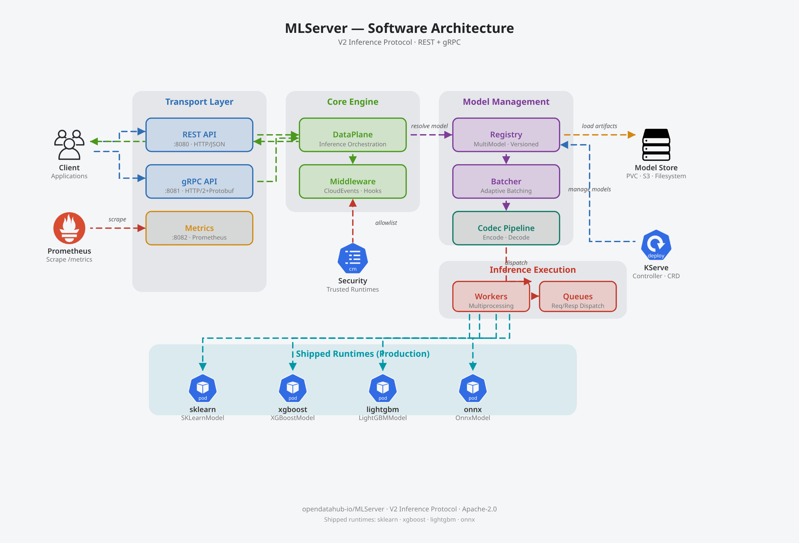

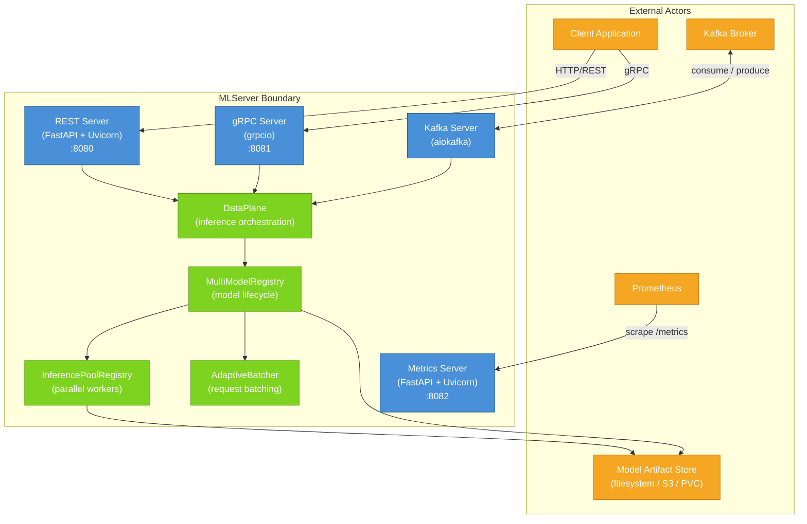

---

## Core Domain Model

The primary classes and their relationships.

```mermaid
classDiagram
    direction LR

    class MLServer {
        -Settings _settings
        -RESTServer _rest_server
        -GRPCServer _grpc_server
        -KafkaServer _kafka_server
        -MetricsServer _metrics_server
        -MultiModelRegistry _model_registry
        -InferencePoolRegistry _inference_pool_registry
        -DataPlane _data_plane
        +start(models_settings) void
        +stop(sig) void
        +add_custom_handlers(model) MLModel
        +reload_custom_handlers(old, new) MLModel
        +remove_custom_handlers(model) MLModel
    }

    class Settings {
        +bool debug
        +int parallel_workers
        +str host
        +int http_port
        +int grpc_port
        +int metrics_port
        +bool kafka_enabled
        +str metrics_endpoint
        +bool cache_enabled
        +bool strict_readiness
        +bool empty_registry_readiness
        +str log_level
        +bool use_structured_logging
        +CORSSettings cors_settings
    }

    class ModelSettings {
        +str name
        +str implementation_
        +str platform
        +int max_batch_size
        +float max_batch_time
        +ModelParameters parameters
        +implementation() type~MLModel~
    }

    class MLModel {
        -ModelSettings _settings
        +bool ready
        +load() bool
        +predict(payload) InferenceResponse
        +predict_stream(payloads) AsyncIterator
        +unload() bool
        +decode(input, codec) Any
        +decode_request(request, codec) Any
        +encode_response(payload, codec) InferenceResponse
        +encode(payload, output, codec) ResponseOutput
        +metadata() MetadataModelResponse
        +name str
        +version str
        +settings ModelSettings
    }

    class MultiModelRegistry {
        -dict~str,SingleModelRegistry~ _models
        -bool _startup_complete
        +load(model_settings) MLModel
        +unload(name) void
        +unload_version(name, version) void
        +get_model(name, version) MLModel
        +get_models(name) list~MLModel~
        +startup_complete() void
        +is_startup_complete bool
    }

    class SingleModelRegistry {
        -dict~str,MLModel~ _versions
        -MLModel _default
        +load(model_settings) MLModel
        +unload() void
        +unload_version(version) void
        +get_model(version) MLModel
        +get_models() list~MLModel~
    }

    class DataPlane {
        -Settings _settings
        -MultiModelRegistry _model_registry
        -ResponseCache _response_cache
        -InferenceMiddlewares _inference_middleware
        +live() bool
        +ready() bool
        +model_ready(name, version) bool
        +metadata() MetadataServerResponse
        +runtimes() RuntimeSecurityResponse
        +infer(payload, name, version) InferenceResponse
        +infer_stream(payloads, name, version) AsyncIterator
    }

    class InferencePoolRegistry {
        -Settings _settings
        -InferencePool _default_pool
        -dict~str,InferencePool~ _pools
        +load_model(model) MLModel
        +reload_model(old, new) MLModel
        +unload_model(model) MLModel
        +model_initialiser(settings) MLModel
        +close() void
    }

    class InferencePool {
        -dict~int,Worker~ _workers
        -WorkerRegistry _worker_registry
        -Dispatcher _dispatcher
        +load_model(model) MLModel
        +reload_model(old, new) MLModel
        +unload_model(model) MLModel
        +on_worker_stop(pid, exit_code) void
        +close() void
    }

    class AdaptiveBatcher {
        -MLModel _model
        -int _max_batch_size
        -float _max_batch_time
        +predict(req) InferenceResponse
    }

    MLServer --> Settings
    MLServer --> MultiModelRegistry
    MLServer --> DataPlane
    MLServer --> InferencePoolRegistry
    MultiModelRegistry *-- SingleModelRegistry : contains 1..*
    SingleModelRegistry o-- MLModel : manages versions
    MLModel --> ModelSettings
    DataPlane --> MultiModelRegistry
    InferencePoolRegistry *-- InferencePool : manages pools
    InferencePool *-- Worker : spawns N
    AdaptiveBatcher --> MLModel : wraps predict
    ModelSettings --> Settings : nested within server
```

---

## Inference Request Flow

End-to-end sequence from client request to response, covering both REST and
gRPC paths converging at the DataPlane.

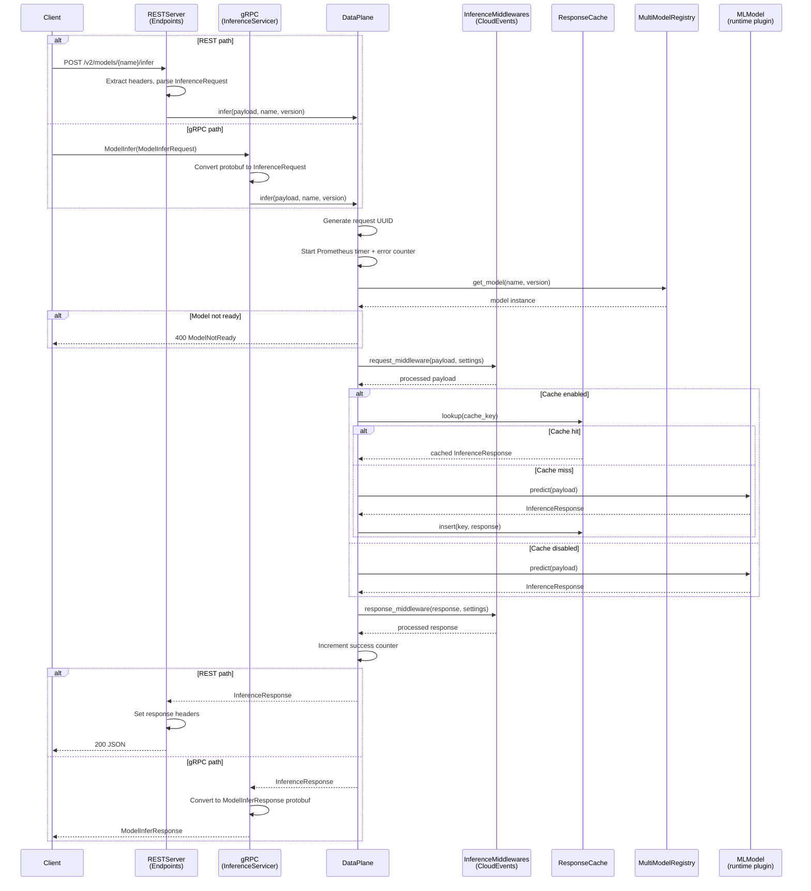

---

## Model Lifecycle

The load, reload, and unload sequence managed by the registry, including
hook execution order.

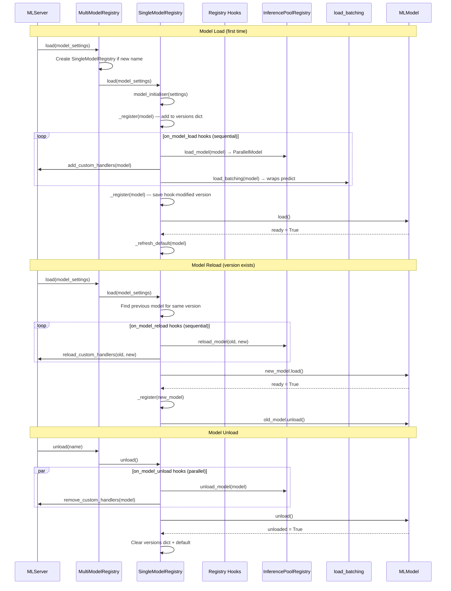

---

## Parallel Inference

How MLServer bypasses the Python GIL using multiprocessing workers,
dispatchers, and message queues.

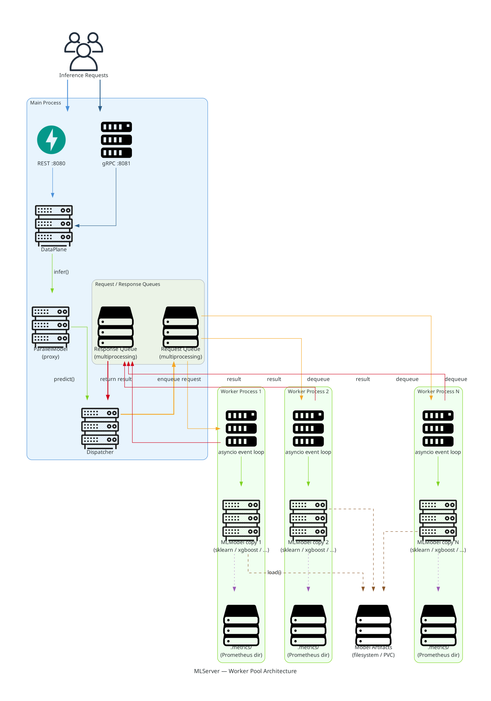

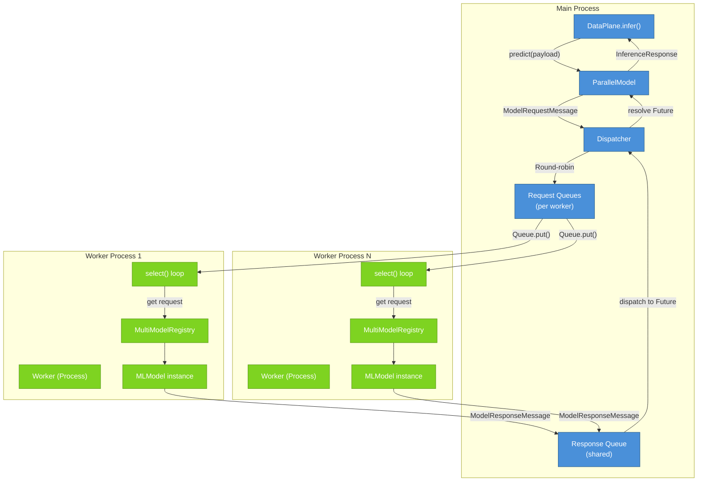

### Worker Lifecycle

Each `Worker` is a `multiprocessing.Process` that:

1. Ignores SIGINT/SIGTERM/SIGQUIT (the main process manages shutdown).
2. Installs uvloop, configures logging and metrics.
3. Initialises its own `MultiModelRegistry` (models are loaded independently
   in each worker).
4. Runs a `select()` loop on two queues: `_requests` (inference) and
   `_model_updates` (load/unload).
5. On unexpected exit, the `InferencePoolRegistry` detects SIGCHLD, spawns a
   replacement worker, and reloads all models from the `WorkerRegistry`.

### Dispatcher

The `Dispatcher` runs in the main process and:

- Routes `ModelRequestMessage` to workers via round-robin.
- Listens on the shared `_responses` queue for `ModelResponseMessage`.
- Resolves the corresponding `asyncio.Future` to return the result to the
  caller.
- Handles `ModelUpdateMessage` (load/unload) by broadcasting to all workers.

### Environment Isolation

The `InferencePoolRegistry` manages multiple `InferencePool` instances, each
associated with a Python environment (extracted from a tarball or an existing
path). Models sharing the same environment share the same pool. The default
pool uses the server's own Python environment.

---

## Adaptive Batching

How individual inference requests are grouped into batches transparently.

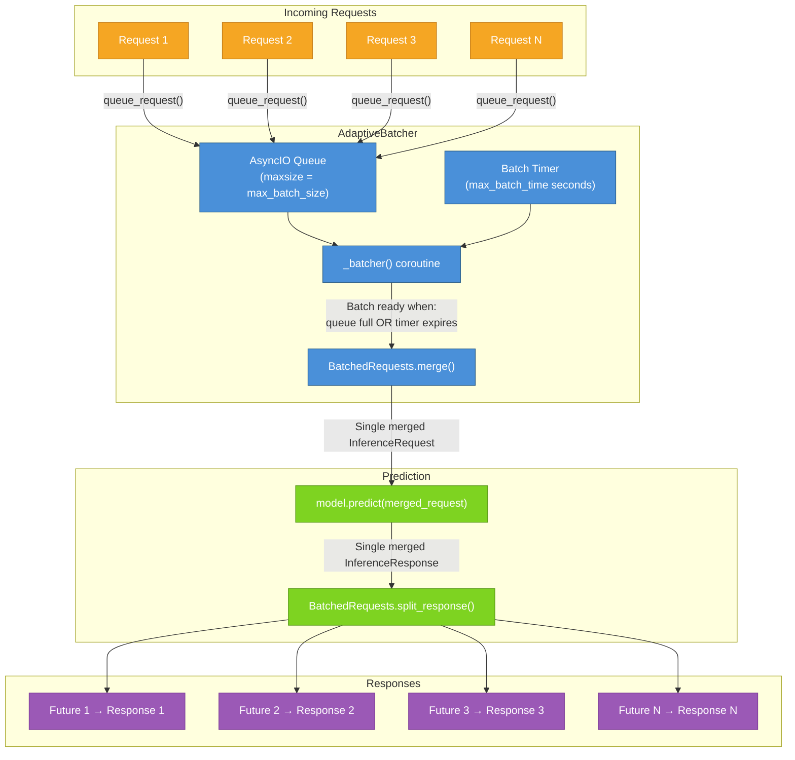

### Batching Mechanics

1. Each `AdaptiveBatcher` wraps a single model's `predict()` method.
2. Incoming requests are placed in an `asyncio.Queue` with
   `maxsize=max_batch_size`.
3. Each caller receives a `Future` that will resolve to its individual
   response.
4. The `_batcher()` coroutine collects requests until either:
   - The queue reaches `max_batch_size`, or
   - `max_batch_time` seconds have elapsed since the first request.
5. Collected requests are merged into a single `InferenceRequest` via
   `BatchedRequests`.
6. The merged request is passed to the model's original `predict()`.
7. The merged response is split back into individual responses, and each
   caller's `Future` is resolved.

Batching is enabled per-model via `ModelSettings.max_batch_size` (> 0) and
`ModelSettings.max_batch_time` (> 0.0). The `load_batching` hook decorates
the model at load time.

---

## Codec System

The type-conversion pipeline between high-level Python objects and V2
Inference Protocol wire format.

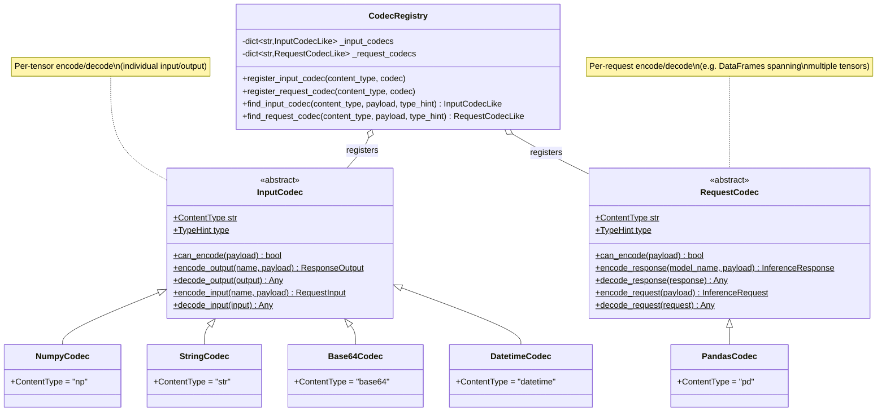

### Codec Resolution

Codecs are resolved in priority order:

1. **Content-type header** — if `content_type` is set on the request input
   or model metadata, the matching codec is used directly.
2. **Payload type** — `can_encode(payload)` is called on each registered
   codec; the first match wins.
3. **Type hint** — `TypeHint` class variable is compared against the target
   type.

The `@register_input_codec` and `@register_request_codec` decorators
auto-register codec classes with the singleton `_CodecRegistry` at import
time.

### Two Levels of Codecs

| Level | Interface | Scope | Example |
|-------|-----------|-------|---------|
| Input/Output | `InputCodec` | Single tensor (one `RequestInput` / `ResponseOutput`) | NumPy array, string list |
| Request | `RequestCodec` | Entire request (multiple tensors) | Pandas DataFrame (columns = tensors) |

---

## Runtime Security

MLServer operates in one of two security modes, determined by the presence
of a trusted runtimes allowlist file at
`/etc/mlserver/trusted-runtimes.json`.

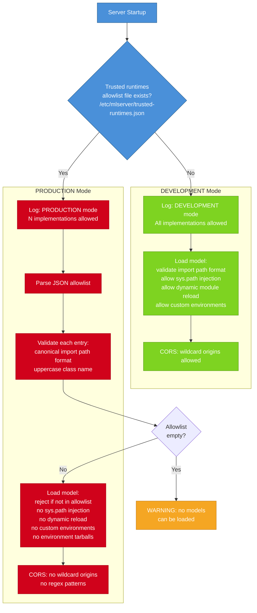

### Security Enforcement Points

Runtime security is enforced at multiple layers (defense in depth):

| Layer | When | What |
|-------|------|------|
| Settings parse | `ModelSettings` validation | `validate_trusted_runtime` rejects untrusted import paths |
| Property access | `ModelSettings.implementation` getter | Re-validates on every access in case `implementation_` was mutated |
| Server startup | `MLServer.start()` | `log_runtime_security_mode()` validates allowlist before any endpoints are accessible |
| Model repository | Discovery scan | Invalid model entries are skipped without crashing the server |
| CORS validation | `Settings` model validator | Blocks wildcard CORS in PRODUCTION mode |
| Environment validation | `ModelParameters` model validator | Blocks `environment_tarball` and `environment_path` in PRODUCTION mode |

### Import Path Validation

All runtime import paths must match the canonical pattern:
```
^[A-Za-z][A-Za-z0-9_-]*(\.[A-Za-z][A-Za-z0-9_-]*)*\.[A-Za-z][A-Za-z0-9_]*$
```

The final segment (class name) must begin with an uppercase letter. Built-in
runtime aliases (e.g., `mlserver_sklearn.sklearn.SKLearnModel` →
`mlserver_sklearn.SKLearnModel`) are canonicalized before validation.

---

## Server Component Layout

How the four server components are initialised and coordinated by `MLServer`.

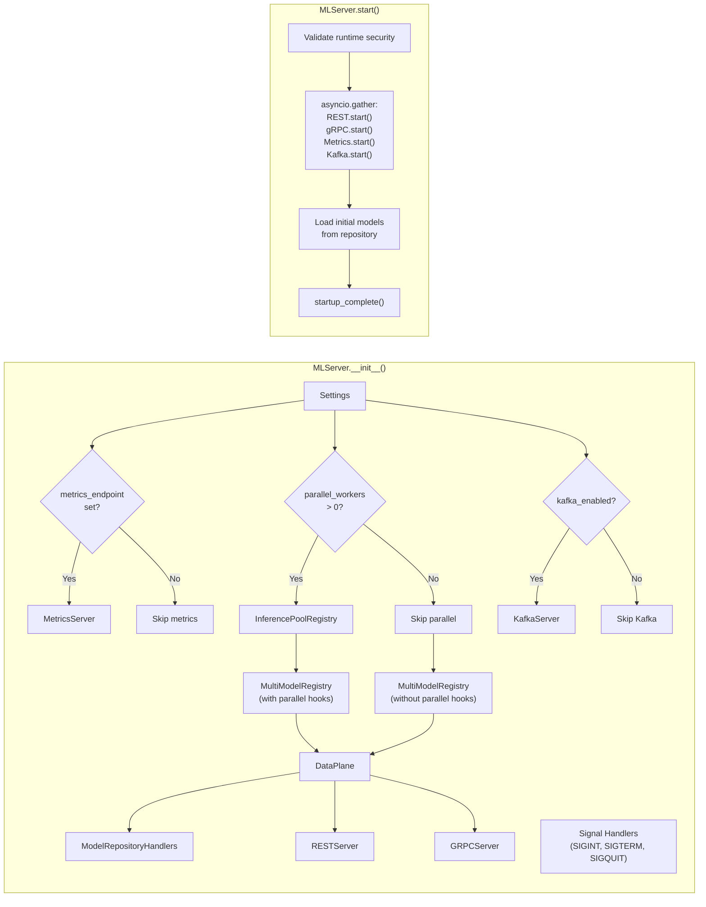

### Startup Sequence

1. Validate runtime security configuration (`log_runtime_security_mode()`).
   If the allowlist is invalid, startup is **aborted** before any endpoint
   becomes accessible.
2. Start all transport servers concurrently via `asyncio.gather()`.
3. Load all models from the model repository concurrently.
4. Mark `startup_complete()` — the readiness endpoint begins returning `true`.
5. If any model fails to load during startup, the server shuts down
   gracefully.

### Shutdown Sequence

1. Close `InferencePoolRegistry` (stop all worker processes).
2. Stop `KafkaServer` (consumer + producer).
3. Stop `GRPCServer`.
4. Stop `RESTServer`.
5. Stop `MetricsServer`.

---

## Configuration Architecture

MLServer uses Pydantic Settings for configuration, supporting environment
variables, `.env` files, and JSON configuration files.

### Configuration Hierarchy

| Scope | Class | Env Prefix | File |
|-------|-------|------------|------|
| Server-wide | `Settings` | `MLSERVER_` | `settings.json` |
| Per-model | `ModelSettings` | `MLSERVER_MODEL_` | `model-settings.json` |
| Model parameters | `ModelParameters` | `MLSERVER_MODEL_` | nested in `model-settings.json` |
| CORS | `CORSSettings` | `MLSERVER_` | nested in `settings.json` |

### Key Settings

| Setting | Default | Effect |
|---------|---------|--------|
| `parallel_workers` | 1 | Number of multiprocessing workers (1 = disabled) |
| `max_batch_size` | 0 | Adaptive batching batch size (0 = disabled) |
| `max_batch_time` | 0.0 | Adaptive batching time window in seconds |
| `strict_readiness` | true | All models must be ready vs. at least one |
| `empty_registry_readiness` | true | Report ready when no models loaded |
| `cache_enabled` | false | Enable response caching |
| `cache_size` | 100 | LRU cache size |

---

## Runtime Plugins

MLServer uses a pluggable runtime architecture. Each plugin is a separate
Python package in the `runtimes/` directory that provides an `MLModel`
subclass.

#### Shipped Runtimes (included in ODH midstream production images)

These runtimes are installed in the container images and covered by the
default trusted runtimes allowlist:

| Plugin | Package | MLModel Subclass | Framework |
|--------|---------|-----------------|-----------|
| scikit-learn | `mlserver-sklearn` | `SKLearnModel` | scikit-learn |
| XGBoost | `mlserver-xgboost` | `XGBoostModel` | XGBoost |
| LightGBM | `mlserver-lightgbm` | `LightGBMModel` | LightGBM |
| ONNX | `mlserver-onnx` | `OnnxModel` | ONNX Runtime |

### Plugin Contract

Every runtime plugin must:

1. Subclass `mlserver.MLModel`.
2. Override `load()` to load model artifacts and return readiness status.
3. Override `predict()` to perform inference and return an
   `InferenceResponse`.
4. Optionally override `predict_stream()` for streaming inference.
5. Optionally override `unload()` to release resources.
6. Optionally override `_configure_framework_logger()` to align framework
   log levels with MLServer's configured level.

### Plugin Discovery

In **DEVELOPMENT** mode, the `implementation` field in `model-settings.json`
is a Python import path (e.g., `mlserver_sklearn.SKLearnModel`). The model
folder is temporarily added to `sys.path` to support custom runtimes.

In **PRODUCTION** mode, only import paths present in the
`/etc/mlserver/trusted-runtimes.json` allowlist are permitted. Dynamic
`sys.path` injection and custom environments are disabled.

---

## Appendix: V2 Inference Protocol Endpoints

### REST Endpoints (port 8080)

| Method | Path | Handler |
|--------|------|---------|
| GET | `/v2/health/live` | `DataPlane.live()` |
| GET | `/v2/health/ready` | `DataPlane.ready()` |
| GET | `/v2` | `DataPlane.metadata()` |
| GET | `/v2/runtime-security` | `DataPlane.runtimes()` |
| GET | `/v2/models/{name}/ready` | `DataPlane.model_ready()` |
| GET | `/v2/models/{name}` | `DataPlane.model_metadata()` |
| POST | `/v2/models/{name}/infer` | `DataPlane.infer()` |
| POST | `/v2/models/{name}/infer_stream` | `DataPlane.infer_stream()` |
| POST | `/v2/repository/index` | `ModelRepositoryHandlers.index()` |
| POST | `/v2/repository/models/{name}/load` | `ModelRepositoryHandlers.load()` |
| POST | `/v2/repository/models/{name}/unload` | `ModelRepositoryHandlers.unload()` |

### gRPC Services (port 8081)

| RPC | Service | Handler |
|-----|---------|---------|
| `ServerLive` | `GRPCInferenceService` | `DataPlane.live()` |
| `ServerReady` | `GRPCInferenceService` | `DataPlane.ready()` |
| `ModelReady` | `GRPCInferenceService` | `DataPlane.model_ready()` |
| `ServerMetadata` | `GRPCInferenceService` | `DataPlane.metadata()` |
| `RuntimeSecurity` | `GRPCInferenceService` | `DataPlane.runtimes()` |
| `ModelMetadata` | `GRPCInferenceService` | `DataPlane.model_metadata()` |
| `ModelInfer` | `GRPCInferenceService` | `DataPlane.infer()` |
| `ModelStreamInfer` | `GRPCInferenceService` | `DataPlane.infer_stream()` |
| `RepositoryIndex` | `GRPCInferenceService` | `ModelRepositoryHandlers.index()` |
| `RepositoryModelLoad` | `GRPCInferenceService` | `ModelRepositoryHandlers.load()` |
| `RepositoryModelUnload` | `GRPCInferenceService` | `ModelRepositoryHandlers.unload()` |
