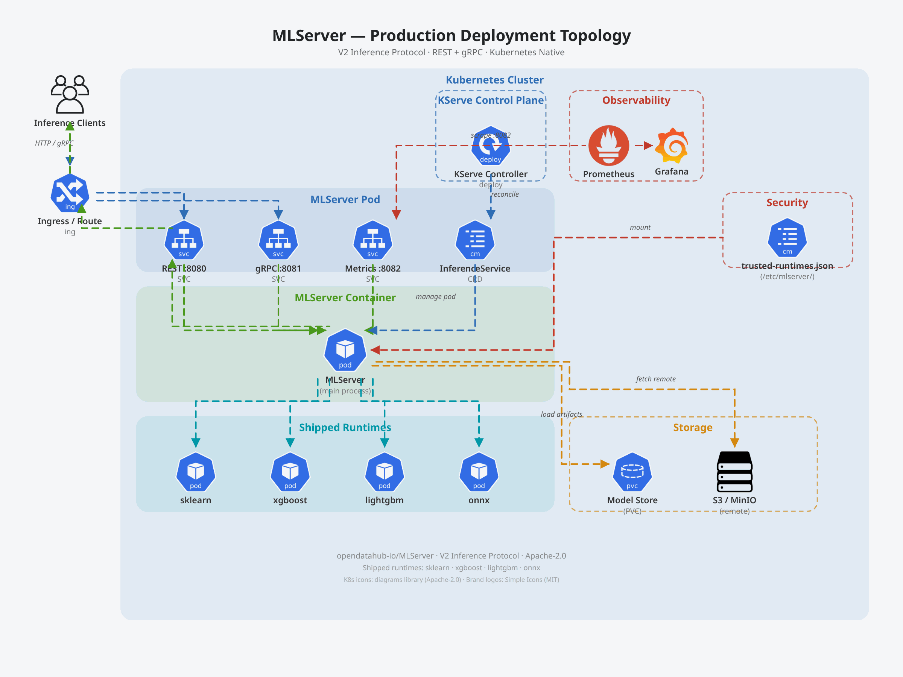

# Deployment Guide

This document covers how to deploy MLServer in different environments, from local development to production Kubernetes clusters.



---

## Container Images

MLServer ships as a set of OCI container images built via Konflux CI pipelines.

### Image Variants

| Variant | Base | GPU Support | Use Case |
|---------|------|-------------|----------|
| `mlserver` | UBI 9 (Python 3.11) | No | CPU-only inference |
| `mlserver-cuda` | UBI 9 + CUDA toolkit | NVIDIA | GPU-accelerated inference |

Images are published to the Red Hat Quay registry. The CPU image includes four
shipped runtimes (sklearn, xgboost, lightgbm, onnx) while the CUDA image
includes only onnx.

### Runtime Security Modes

Production images include a `/etc/mlserver/trusted-runtimes.json` allowlist that restricts which model implementations can be loaded:

| Mode | Trigger | Behavior |
|------|---------|----------|
| **DEVELOPMENT** | No allowlist file present | All `implementation` values accepted |
| **PRODUCTION** | Allowlist file exists | Only allowlisted import paths accepted |

See [security.md](security.md) for the full security model.

---

## Local Development

### Running from Source

```bash
# Install dependencies
poetry install --with dev

# Start with default settings
mlserver start .

# Start with custom settings
mlserver start /path/to/model/repository
```

### Running with Docker

```bash
# Build local image
docker build -t mlserver:dev .

# Run with model repository mounted
docker run -p 8080:8080 -p 8081:8081 -p 8082:8082 \
  -v /path/to/models:/mnt/models \
  -e MLSERVER_MODEL_REPOSITORY_ROOT=/mnt/models \
  mlserver:dev
```

---

## Kubernetes Deployment

### Standalone Pod

```yaml
apiVersion: v1
kind: Pod
metadata:
  name: mlserver
  labels:
    app: mlserver
spec:
  containers:
    - name: mlserver
      image: quay.io/opendatahub/mlserver:latest
      ports:
        - containerPort: 8080
          name: http
        - containerPort: 8081
          name: grpc
        - containerPort: 8082
          name: metrics
      env:
        - name: MLSERVER_MODEL_REPOSITORY_ROOT
          value: /mnt/models
        - name: MLSERVER_PARALLEL_WORKERS
          value: "2"
      volumeMounts:
        - name: model-store
          mountPath: /mnt/models
      readinessProbe:
        httpGet:
          path: /v2/health/ready
          port: 8080
        initialDelaySeconds: 10
        periodSeconds: 5
      livenessProbe:
        httpGet:
          path: /v2/health/live
          port: 8080
        initialDelaySeconds: 5
        periodSeconds: 10
      resources:
        requests:
          cpu: "500m"
          memory: "512Mi"
        limits:
          cpu: "2"
          memory: "2Gi"
  volumes:
    - name: model-store
      persistentVolumeClaim:
        claimName: model-store-pvc
```

### Service and Ingress

```yaml
apiVersion: v1
kind: Service
metadata:
  name: mlserver
spec:
  selector:
    app: mlserver
  ports:
    - name: http
      port: 8080
      targetPort: 8080
    - name: grpc
      port: 8081
      targetPort: 8081
    - name: metrics
      port: 8082
      targetPort: 8082
```

### KServe InferenceService

MLServer serves as a runtime within KServe's `ServingRuntime` framework:

```yaml
apiVersion: serving.kserve.io/v1beta1
kind: InferenceService
metadata:
  name: iris-model
spec:
  predictor:
    model:
      modelFormat:
        name: sklearn
      runtime: mlserver
      storageUri: s3://models/iris
      resources:
        requests:
          cpu: "500m"
          memory: "512Mi"
```

---

## Health Checks

MLServer exposes V2-compliant health endpoints for orchestrator integration:

| Endpoint | Protocol | Purpose | Kubernetes Probe |
|----------|----------|---------|------------------|
| `GET /v2/health/live` | REST | Server process is alive | `livenessProbe` |
| `GET /v2/health/ready` | REST | Models loaded and ready | `readinessProbe` |
| `ServerLive` | gRPC | Server process is alive | gRPC health check |
| `ServerReady` | gRPC | Models loaded and ready | gRPC health check |

### Readiness Behavior

Readiness depends on two settings:

- **`strict_readiness: true`** (default) — ALL models must be ready
- **`strict_readiness: false`** — AT LEAST ONE model must be ready
- **`empty_registry_readiness: true`** (default) — Ready when no models loaded
- **`empty_registry_readiness: false`** — Not ready when no models loaded

During server startup (before `startup_complete` is set), readiness always returns `false` to prevent premature traffic routing.

---

## Parallel Inference

For CPU-bound models, enable parallel workers to bypass the Python GIL:

```json
{
  "parallel_workers": 4,
  "parallel_workers_timeout": 10
}
```

Each worker runs in a separate process with its own copy of the model.
Communication between the main process and workers uses multiprocessing queues.

### Resource Considerations

- Each worker loads a full copy of the model into memory
- Total memory ≈ `parallel_workers × model_size + overhead`
- Set CPU requests/limits to at least `parallel_workers` cores
- The `.metrics` directory must be shared across workers (configured via `metrics_dir`)

---

## Metrics and Monitoring

### Prometheus Integration

MLServer exports Prometheus metrics on the metrics port (default: 8082):

```yaml
# Prometheus scrape config
- job_name: mlserver
  scrape_interval: 15s
  metrics_path: /metrics
  static_configs:
    - targets: ['mlserver:8082']
```

### Key Metrics

| Metric | Type | Description |
|--------|------|-------------|
| `model_infer_request_success` | Counter | Successful inferences per model |
| `model_infer_request_failure` | Counter | Failed inferences per model |
| `model_infer_request_duration` | Summary | Inference latency per model |
| `rest_server_requests_total` | Counter | Total REST requests |

### OpenTelemetry Tracing

Enable distributed tracing by setting the tracing server:

```json
{
  "tracing_server": "jaeger-collector:4317"
}
```

MLServer instruments FastAPI with OpenTelemetry, excluding health-check endpoints from traces.

---

## Response Caching

Enable caching to avoid redundant inference for repeated inputs:

```json
{
  "cache_enabled": true,
  "cache_size": 100
}
```

- Cache is an in-memory LRU cache keyed on the serialized `InferenceRequest`
- Individual models can opt out by setting `cache_enabled: false` in `model-settings.json`
- Cache is not shared across parallel workers
- Streaming inference responses are not cached

---

## Environment Variables Reference

All `settings.json` fields can be set via environment variables:

```bash
# Server configuration
MLSERVER_HOST=0.0.0.0
MLSERVER_HTTP_PORT=8080
MLSERVER_GRPC_PORT=8081
MLSERVER_METRICS_PORT=8082
MLSERVER_DEBUG=false
MLSERVER_LOG_LEVEL=INFO
MLSERVER_ACCESS_LOG=true

# Model repository
MLSERVER_MODEL_REPOSITORY_ROOT=/mnt/models
MLSERVER_LOAD_MODELS_AT_STARTUP=true

# Parallel inference
MLSERVER_PARALLEL_WORKERS=1
MLSERVER_PARALLEL_WORKERS_TIMEOUT=5

# Caching
MLSERVER_CACHE_ENABLED=false
MLSERVER_CACHE_SIZE=100

# Kafka
MLSERVER_KAFKA_ENABLED=false
MLSERVER_KAFKA_SERVERS=localhost:9092
MLSERVER_KAFKA_TOPIC_INPUT=mlserver-input
MLSERVER_KAFKA_TOPIC_OUTPUT=mlserver-output

# Tracing
MLSERVER_TRACING_SERVER=jaeger:4317
```

Model-specific settings use the `MLSERVER_MODEL_` prefix or a `.env` file alongside `model-settings.json`.

---

## CI/CD Pipelines

MLServer uses Konflux for container image builds and Prow for pre-merge testing:

| Pipeline | Trigger | Purpose |
|----------|---------|---------|
| Konflux build | Push to `release/*` | Build and publish container images |
| Prow pre-submit | PR opened | Run unit and integration tests |
| Early-gate | PR opened | Fast validation of critical paths |
| Tag creation | Manual / workflow | Create release tags |

See the `.tekton/` directory for pipeline definitions and `.github/workflows/` for GitHub Actions workflows.
